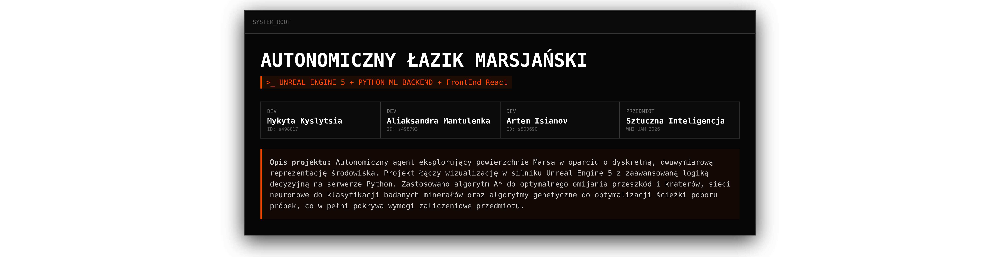

<!-- PROJECT LOGO -->

  

Autonomiczny Łazik Marsjański
UNREAL ENGINE 5 + PYTHON ML BACKEND

Opis projektu: Autonomiczny agent eksplorujący powierzchnię Marsa w oparciu o dyskretną, dwuwymiarową reprezentację środowiska. Projekt łączy wizualizację w silniku Unreal Engine 5 z zaawansowaną logiką decyzyjną na serwerze Python.