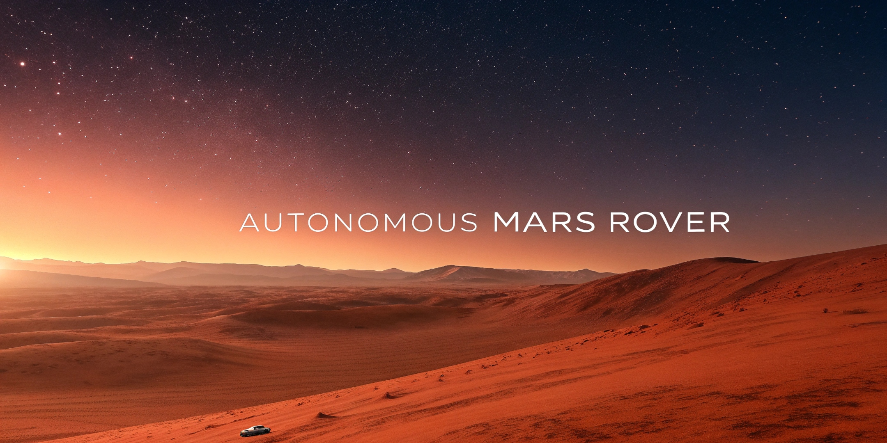

<div align="center" style="margin: 0; padding: 0;">
  <a href="#" style="display: block; margin: 0;">
    
  </a>

<h3 align="center" style="margin: 0;">Autonomous Mars Rover</h3>
<h4 align="center" style="margin: 0;">UNREAL ENGINE 5 + PYTHON ML BACKEND + REACT FRONTEND</h4>
</div>

Project Description: An autonomous agent exploring the surface of Mars based on a discrete, two-dimensional representation of the environment. The project combines visualization in Unreal Engine 5 with advanced decision-making logic on a Python server and a web-based control panel built with React.

### Built With

-   
-   
-   
-   
-   
-   

Technology Stack:
Backend: Python, FastAPI, Uvicorn, Pydantic (Logic and API).
Frontend: Unreal Engine 5 (3D Visualization), React 18 + TypeScript, Lucide React (Web UI / Control Panel).
Communication Protocol: HTTP/REST (JSON).
Version Control: Git (Gitea).

---

<div align="center">
  <h1>🔴 M.A.R.S. AUTONOMOUS ROVER // TELEMETRY HUB</h1>
  
  <p>
    <kbd>UNREAL ENGINE 5</kbd> ✛ <kbd>PYTHON ML BACKEND</kbd> ✛ <kbd>REACT FRONTEND</kbd>
  </p>

  <blockquote>
    <i><b>Mission Brief:</b> An autonomous agent exploring the surface of Mars based on a discrete, two-dimensional representation of the environment. The project combines visualization in Unreal Engine 5 with advanced decision-making logic on a Python server and a web-based control panel built with React.</i>
  </blockquote>

  <p><code>[SYSTEM STATUS: ONLINE]</code> • <code>[LINK: SECURE]</code> • <code>[ORBITAL SYNC: 100%]</code></p>
</div>

<hr>

<details open>
  <summary><kbd>🛰️ ROOT</kbd> <b><code>/AI-COURSE-PROJECT</code></b> ── <i>Ares Core Architecture</i></summary>
  
  <blockquote>
    <details open>
      <summary>🟧 <kbd>📁 backend</kbd> ── <i>Python API & AI Brain 🧠</i></summary>
      <blockquote>
        <details open>
          <summary>🔸 <kbd>📁 app</kbd> ── <i>FastAPI Server Application</i></summary>
          <blockquote>
            <details open>
              <summary>⚙️ <kbd>📁 core</kbd> ── <i>Simulation Engine</i></summary>
              <blockquote>
                🤖 <code>agent.py</code> ── Rover decision-making & movement logic<br>
                🗺️ <code>environment.py</code> ── 2D discrete grid world boundaries
              </blockquote>
            </details>
            🌐 <code>main.py</code> ── Server setup & React CORS configuration<br>
            📡 <code>api.py</code> ── REST endpoints (<code>/state</code>, <code>/step</code>)<br>
            📐 <code>models.py</code> ── Pydantic data schemas (GameState, Position)
          </blockquote>
        </details>
        🔸 <code>📁 venv/</code> ── Isolated environment <i>(ignored)</i><br>
        🔸 <code>📄 requirements.txt</code> ── Backend dependency matrix<br>
        🔥 <b><kbd>🚀 run.py</kbd></b> ── <i>MAIN SERVER IGNITION (Entry Point)</i>
      </blockquote>
    </details>
    <details open>
      <summary>🟧 <kbd>📁 frontend_ue</kbd> ── <i>3D Mars Surface Simulation (UE5) 🎮</i></summary>
      <blockquote>
        🔸 <code>📁 Config/</code> ── Physics & Environment parameters<br>
        🔸 <code>📁 Content/</code> ── Rover meshes, textures, blueprints<br>
        🔸 <code>📁 DerivedDataCache/</code> & <code>Intermediate/</code> ── Engine cache & compiled data<br>
        🔸 <code>📁 Saved/</code> ── Autosaves & Crash logs<br>
        🔸 <code>📄 Content.dvc</code> ── Large topology assets version control<br>
        🔷 <b><kbd>frontend_ue.uproject</kbd></b> ── <i>Unreal Engine Launcher</i>
      </blockquote>
    </details>
    <details>
      <summary>🟨 <kbd>📁 frontend_backup</kbd> ── <i>React Web Control Panel 💻</i></summary>
      <blockquote>
        🔸 <code>📁 public/</code> & <code>📁 src/</code> ── UI source code & React components<br>
        🔸 <code>📁 node_modules/</code> ── Web dependencies<br>
        🔸 <code>📄 index.html</code> ── Dashboard entry point<br>
        🔸 <code>📄 package.json</code> ── Node packages<br>
        🔸 <code>📄 tsconfig.*.json</code> ── TypeScript strict typing rules<br>
        🔸 <code>📄 vite.config.ts</code> ── Web bundler config (Runs on port 5173)
      </blockquote>
    </details>
    <details>
      <summary>🟫 <kbd>📁 assets</kbd> ── <i>Mission Media 📸</i></summary>
      <blockquote>
        🔸 <code>🖼️ banner.png</code> ── Mission patch / Banner<br>
        🔸 <code>🖼️ banner-2.jpg</code> ── Alternative banner<br>
        🔸 <code>📄 index.html</code> ── Asset viewer index
      </blockquote>
    </details>
    <details open>
      <summary>📜 <kbd>MISSION DIRECTIVES & LOGS</kbd></summary>
      <blockquote>
        📑 <code>CONTRIBUTING.md</code> ── Crew collaboration guidelines<br>
        📊 <code>REPORTS.md</code> ── Rover test analytics & flight reports<br>
        🔬 <code>test.ipynb</code> ── Jupyter Notebook for AI experiments<br>
        📖 <code>README.md</code> ── Main mission documentation <i>(You are here)</i>
      </blockquote>
    </details>
  </blockquote>
</details>
<hr>
<div align="center">
  <sub><i>Initiated by Mars Rover Dev Team • Built with Python, React & Unreal Engine 5</i></sub>
</div>

---

# 🚀 Getting Started: Building and Running

This guide will help you set up the Mars Rover project environment. Please ensure you have **Git**, **Python**, **Node.js (for React UI)**, and **Unreal Engine 5** installed.

## 1. Clone the Repository

```sh
git clone https://git.wmi.amu.edu.pl/s498817/ai-course-project.git
cd ai-course-project
```

---

## 2. Backend Setup (FastAPI)

The core simulation logic runs on a FastAPI server.

1. Navigate to the backend directory:
   ```sh
   cd backend
   ```

2. Create and activate a virtual environment:
   ```sh
   # macOS/Linux
   python3 -m venv venv
   source venv/bin/activate
   
   # Windows
   python -m venv venv
   venv\Scripts\activate
   ```

3. Install dependencies:
   ```sh
   pip install -r requirements.txt
   ```

4. Launch the development server:
   ```sh
   python run.py
   ```

> [!IMPORTANT]
> The Backend API is available at **[http://localhost:8000/docs](http://localhost:8000/docs)**. Use this interface to test API endpoints and verify the simulation logic.

---

## 🗄️ Working with Assets (DVC)

We use **DVC (Data Version Control)** to manage heavy 3D assets (textures, models) without bloating the Git repository.

> [!CAUTION]
> **Cloud Storage Access Required:** The project uses an encrypted Google Drive remote. To access the heavy assets, you need the service account credentials.

### Accessing Assets:
1. **Request Credentials:** If you are a team member, email the Lead Developer (Nikita) at **[nikita.kyslytsia@example.com](mailto:nikita.kyslytsia@example.com)** to request the necessary JSON keys.
2. **Setup:** Place the key file in the root folder, then configure DVC locally:
   ```sh
   dvc remote modify --local myremote gdrive_client_id <CLIENT_ID>
   dvc remote modify --local myremote gdrive_client_secret <CLIENT_SECRET>
   ```
3. **Pull Assets:** Once configured, download all assets with:
   ```sh
   dvc pull
   ```

---

## 🌐 Frontend Control Panel (React)

For real-time agent monitoring, we use a React-based dashboard. Ensure you have **[Node.js](https://nodejs.org/en)** installed.

1. Navigate to the React directory:
   ```sh
   cd frontend_backup
   ```

2. Install dependencies:
   ```sh
   npm install
   ```

3. Run the development server:
   ```sh
   npm run dev
   ```

> [!TIP]
> The Web UI will be available at **[http://localhost:5173](http://localhost:5173)**, providing a dashboard to monitor the agent's real-time state.

---

## 🎮 Unreal Engine 5 Setup

The UE5 frontend provides the high-fidelity 3D visualization.

1. Open the project folder `frontend_ue` in **Unreal Engine 5**.
2. Ensure you have run `dvc pull` (see above) so all 3D assets are downloaded.
3. Configure the HTTP requests in the Blueprints to point to `http://localhost:8000/state`.
4. Choose game scene
5. Press **Play** in the UE5 Editor to start the visualization.
