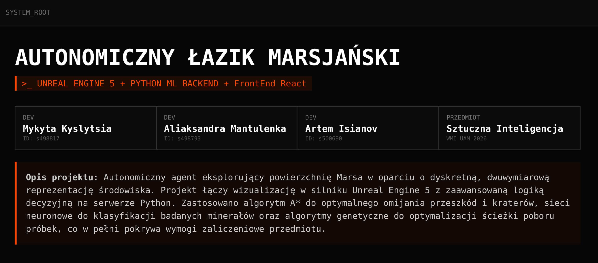

  

<h3 align="center" style="margin: 0;">Autonomous Mars Rover</h3>
<h4 align="center" style="margin: 0;">UNREAL ENGINE 5 + PYTHON ML BACKEND + REACT FRONTEND</h4>

Project Description: An autonomous agent exploring the surface of Mars based on a discrete, two-dimensional representation of the environment. The project combines visualization in Unreal Engine 5 with advanced decision-making logic on a Python server and a web-based control panel built with React.

### Built With

-   
-   
-   
-   
-   
-   
-   

Technology Stack:
Backend: Python 3.12+, FastAPI, Uvicorn, Pydantic (Logic and API).
Frontend: Unreal Engine 5 (3D Visualization), React 18 + TypeScript, Lucide React (Web UI / Control Panel).
Communication Protocol: HTTP/REST (JSON).
Version Control: Git (Gitea).
